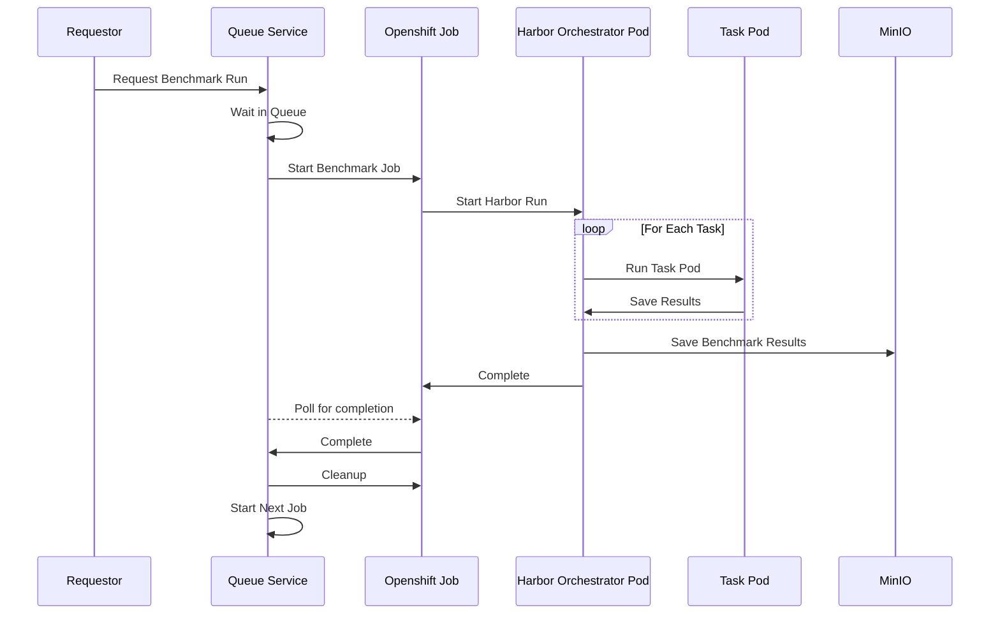

# Coding Agent Bench

Reproducible benchmarks for coding agents and models using Harbor

## Features

- Complete instructions for running popular benchmarks with open models
- CLI utility to simplify benchmark runs against self-hosted models
- Deployable queue service for scheduling benchmark runs in OpenShift 
- Leaderboards for popular benchmarks with instructions for reproducing results
- Full manifests for deploying open models on OpenShift with vLLM

## Table of Contents

- [Features](#features)
- [Leaderboards](#leaderboards)
  - [SWE-Bench Verified (pass@1, N=500)](#swe-bench-verified-pass1-n500)
  - [SWE-Bench Pro - Ansible Tasks (pass@1, N=96)](#swe-bench-pro---ansible-tasks-pass1-n96)
  - [Terminal Bench 2.0 (pass@1, N=87)](#terminal-bench-20-pass1-n87)
- [CLI Utility](#cli-utility)
  - [Prerequisites](#prerequisites)
  - [Run a Benchmark](#run-a-benchmark)
- [Queue Service](#queue-service)
  - [Set up the service](#set-up-the-service)
  - [Use the service](#use-the-service)
- [Harbor Command Examples](#harbor-command-examples)
  - [Claude Code vLLM](#claude-code-vllm)
  - [Codex vLLM](#codex-vllm)
  - [OpenClaw vLLM](#openclaw-vllm)
  - [OpenCode vLLM](#opencode-vllm)
  - [Pi vLLM](#pi-vllm)
  - [Qwen Code vLLM](#qwen-code-vllm)
  - [Claude Code Anthropic](#claude-code-anthropic)
  - [Claude Code VertexAI](#claude-code-vertexai)
  - [Codex OpenAI](#codex-openai)
- [Deploy models with vLLM](#deploy-models-with-vllm)
- [SWE-Bench Acceleration](#swe-bench-acceleration)
  - [Use accelerated images for SWE-bench-verified](#use-accelerated-images-for-swe-bench-verified)
  - [Pre-pull base images](#pre-pull-base-images)
- [Run with Openshift](#run-with-openshift)
  - [Run Tasks in Openshift (Orchestrate Locally)](#run-tasks-in-openshift-orchestrate-locally)
  - [Run Tasks and Orchestrate in Openshift](#run-tasks-and-orchestrate-in-openshift)
- [WIP](#wip)
  - [Run with Podman](#run-with-podman)
  - [Run with Gemini and Gemini CLI](#run-with-gemini-and-gemini-cli)
  - [Run with vLLM and Gemini CLI](#run-with-vllm-and-gemini-cli)


## Leaderboards

<h3>✨ <a href="https://huggingface.co/spaces/taagarwa/coding-agent-leaderboard">Check out our Coding Agent Leaderboard on HuggingFace</a> ✨</h3>

### SWE-Bench Verified (pass@1, N=500)

| Model                          | Harness     | Score                                                            | Cost            |
| ------------------------------ | ----------- | ---------------------------------------------------------------- | --------------- |
| Opus 4.8                       | Claude Code | [86.8%](./benchmarks/SWE_Bench_Opus_4.8_Claude_Code.md)          | $395            |
| Opus 4.8                       | OpenCode    | [83.4%](./benchmarks/SWE_Bench_Opus_4.8_OpenCode.md)             | $320            |
| GPT 5.5                        | Codex       | [79.8%](./benchmarks/SWE_Bench_GPT_5.5_Codex.md)                 | $443            |
| Sonnet 4.6                     | Claude Code | [79.6%](https://www.anthropic.com/news/claude-sonnet-4-6)        | N/A             |
| RedHatAI/Qwen3.6-35B-A3B-NVFP4 | Pi          | [65.0%](./benchmarks/SWE_Bench_Qwen3.6_35b_NVFP4_Pi.md)          | $51<sup>†</sup> |
| RedHatAI/Qwen3.6-35B-A3B-NVFP4 | Qwen Code   | [63.8%](./benchmarks/SWE_Bench_Qwen3.6_35b_NVFP4_Qwen_Code.md)   | $37<sup>†</sup> |
| RedHatAI/Qwen3.6-35B-A3B-NVFP4 | Claude Code | [63.2%](./benchmarks/SWE_Bench_Qwen3.6_35b_NVFP4_Claude_Code.md) | $48<sup>†</sup> |
| RedHatAI/Qwen3.6-35B-A3B-NVFP4 | OpenClaw    | [58.8%](./benchmarks/SWE_Bench_Qwen3.6_35b_NVFP4_OpenClaw.md)    | $33<sup>†</sup> |
| RedHatAI/Qwen3.6-35B-A3B-NVFP4 | OpenCode    | [54.8%](./benchmarks/SWE_Bench_Qwen3.6_35b_NVFP4_OpenCode.md)    | $67<sup>†</sup> |


### SWE-Bench Pro - Ansible Tasks (pass@1, N=96)

| Model                          | Harness     | Score                                                                        | Cost            |
| ------------------------------ | ----------- | ---------------------------------------------------------------------------- | --------------- |
| Opus 4.8                       | OpenCode    | [78.1%](./benchmarks/SWE_Bench_Pro_Ansible_Opus_4.8_OpenCode.md)             | $151            |
| Opus 4.8                       | Claude Code | [69.8%](./benchmarks/SWE_Bench_Pro_Ansible_Opus_4.8_Claude_Code.md)          | $186            |
| GPT 5.5                        | Codex       | [60.4%](./benchmarks/SWE_Bench_Pro_Ansible_GPT_5.5_Codex.md)                 | $188            |
| GPT 5.5                        | OpenCode    | [57.3%](./benchmarks/SWE_Bench_Pro_Ansible_GPT_5.5_OpenCode.md)              | $111            |
| Opus 4.6                       | Claude Code | [51.0%](./benchmarks/SWE_Bench_Pro_Ansible_Opus_4.6_Claude_Code.md)          | $172            |
| Sonnet 4.6                     | Claude Code | [50.0%](./benchmarks/SWE_Bench_Pro_Ansible_Sonnet_4.6_Claude_Code.md)        | $184            |
| RedHatAI/Qwen3.6-35B-A3B-NVFP4 | Pi          | [47.9%](./benchmarks/SWE_Bench_Pro_Ansible_Qwen3.6_35b_NVFP4_Pi.md)          | $13<sup>†</sup> |
| RedHatAI/Qwen3.6-35B-A3B-NVFP4 | Claude Code | [45.6%](./benchmarks/SWE_Bench_Pro_Ansible_Qwen3.6_35b_NVFP4_Claude_Code.md) | $10<sup>†</sup> |
| RedHatAI/Qwen3.6-35B-A3B-NVFP4 | Qwen Code   | [43.8%](./benchmarks/SWE_Bench_Pro_Ansible_Qwen3.6_35b_NVFP4_Qwen_Code.md)   | $9<sup>†</sup>  |
| RedHatAI/Qwen3.6-35B-A3B-NVFP4 | OpenClaw    | [40.6%](./benchmarks/SWE_Bench_Pro_Ansible_Qwen3.6_35b_NVFP4_OpenClaw.md)    | $9<sup>†</sup>  |
| RedHatAI/Qwen3.6-35B-A3B-NVFP4 | OpenCode    | [37.5%](./benchmarks/SWE_Bench_Pro_Ansible_Qwen3.6_35b_NVFP4_OpenCode.md)    | $11<sup>†</sup> |


### Terminal Bench 2.0 (pass@1, N=87)

| Model                          | Harness  | Score                                                              | Cost            |
| ------------------------------ | -------- | ------------------------------------------------------------------ | --------------- |
| RedHatAI/Qwen3.6-35B-A3B-NVFP4 | Pi       | [36.0%](./benchmarks/Terminal_Bench_Qwen3.6_35b_NVFP4_Pi.md)       | $11<sup>†</sup> |
| RedHatAI/Qwen3.6-35B-A3B-NVFP4 | OpenCode | [30.3%](./benchmarks/Terminal_Bench_Qwen3.6_35b_NVFP4_OpenCode.md) | $11<sup>†</sup> |
| RedHatAI/Qwen3.6-35B-A3B-NVFP4 | OpenClaw | [20.2%](./benchmarks/Terminal_Bench_Qwen3.6_35b_NVFP4_OpenClaw.md) | $10<sup>†</sup> |


More coming soon...

<sup>†</sup> - Cost estimates for OSS models are calculated by ($4 per A100 GPU hour × agent benchmark duration).

## CLI Utility

The CLI utility will help you configure and run a benchmark jobs with Harbor for self-hosted models.
It automatically constructs and runs the Harbor job command for your specified benchmark, agent, self-hosted model.

### Prerequisites

- Install dependencies with uv
    
    ```bash
    uv sync
    ```

- [Set up a vLLM server](#deploy-models-with-vllm), or other Anthropic- and OpenAI-compatible server
- Select a benchmark from among the options in [Harbor Hub](https://hub.harborframework.com/)

### Run a Benchmark

The following is the minimal configuration needed to run a job with the CLI:

```sh
uv run coding-agent-bench run \
    --agent <agent> \
    --dataset <benchmark-name> \
    --model-name <model-name> \
    --server-url <server-url>
```

For example, to run `swe-bench/swe-bench-verified` in Claude Code against a self-hosted model:

```sh
uv run coding-agent-bench run \
    --agent claude-code \
    --dataset scale-ai/swe-bench-pro \
    --model-name my-model \
    --server-url http://my.server.url
```

If you want to see a preview of Harbor command that would be run for a given set of arguments without actually running the job, add the `--dry-run` flag.

> [!note]
> Additional configuration options are available, use `uv run coding-agent-bench run --help` to see them.

## Queue Service

The queue service is a FastAPI application that can be deployed on OpenShift to queue and run benchmarks automatically.
Benchmark results are stored to MinIO for later review.



### Set up the service

1. Log in to your cluster and project:
    ```sh
    oc login --server=<server> --token=<token>
    oc project <project>
    ```
2. Create the MinIO service for artifact storage:
    ```sh
    oc apply -f deploy/harbor-minio.yml
    ```
    Note: the default username and password are `(minioadmin, minioadmin)`.
    You can update this in the deployment file if needed.
3. Create the orchestrator and task service accounts:
    ```sh
    oc apply -f deploy/harbor-orchestrator-sa.yml
    oc apply -f deploy/harbor-task-sa.yml
    ```
4. Create a secret file named `job-queue-secret` with an `API_KEY` and apply it:
    ```yaml
    apiVersion: v1
    kind: Secret
    metadata:
      name:  job-queue-secret
    stringData:
      API_KEY: <your-api-key>
    type: Opaque
    ```
5. Create the queue service:
    ```sh
    oc apply -f deploy/job-queue-service.yml
    ```

Get the route for the deployed service:

```sh
oc get route job-queue-route --output jsonpath='{.spec.host}'
```

Check that the application is live by visiting the docs:

```sh
export JOB_QUEUE_URL="https://$(oc get route job-queue-route --output jsonpath='{.spec.host}')"
open $JOB_QUEUE_URL/docs
```

### Use the service

Queue up a new benchmark task:

```sh
curl -X POST $JOB_QUEUE_URL/jobs -d '{"job_name": "test", "agent": "pi", "dataset": "swe-bench/swe-bench-verified", "model_name": "qwen3.6-27b", "server_url": "<server-url>", "n_tasks": 1}' -H "Content-Type: application/json" -H "X-API-Key: <your-api-key>"
```

```json
{
    "message":"Job created.",
    "job_id":"b5ef13c8-8909-4bf1-b5b1-43354e9f395c", 
    ... 
}
```

View the queued/running/completed tasks:

```sh
open $JOB_QUEUE_URL/ui
```

Or list them from the API:

```sh
curl $JOB_QUEUE_URL/jobs -H "X-API-Key: <your-api-key>"
```

Cancel a running or queued job:

```sh
curl -X DELETE $JOB_QUEUE_URL/jobs/<job_id> -H "X-API-Key: <your-api-key>"
```

## Harbor Command Examples

**Prerequisites:**

- Install [Harbor](https://www.harborframework.com/docs/getting-started)
- [Set up a vLLM server](#deploy-models-with-vllm), or other Anthropic- and OpenAI-compatible server
- Set your benchmark in your environment from among the options in [Harbor Hub](https://hub.harborframework.com/), e.g.:

    ```bash
    export BENCHMARK='swe-bench/swe-bench-verified'
    ```

- If you need to filter tasks in your benchmark by name, add the `-i` flag with your glob pattern to your `harbor run` command, e.g. `-i "*ansible*"`

**Directory:**

| Harness     | Model Server | Example                        | Status    |
| ----------- | ------------ | ------------------------------ | --------- |
| Claude Code | vLLM         | [Link](#claude-code-vllm)      | Validated |
| Codex       | vLLM         | [Link](#codex-vllm)            | Testing   |
| OpenClaw    | vLLM         | [Link](#openclaw-vllm)         | Validated |
| OpenCode    | vLLM         | [Link](#opencode-vllm)         | Validated |
| Pi          | vLLM         | [Link](#pi-vllm)               | Validated |
| Qwen Code   | vLLM         | [Link](#qwen-code-vllm)        | Validated |
| Claude Code | Anthropic    | [Link](#claude-code-anthropic) | Validated |
| Claude Code | VertexAI     | [Link](#claude-code-vertexai)  | Validated |
| Codex       | OpenAI       | [Link](#codex-openai)          | Validated |

> [!note]
> To use with a locally hosted model (e.g. llama.cpp) use a vLLM example and set `SERVER_URL=http://host.docker.internal:<server-port>`

### Claude Code vLLM

Set the following variables in your environ:

```bash
export SERVER_URL=
export MODEL_NAME=
```

Then run:

```bash
harbor run --agent claude-code -d $BENCHMARK \
    --ae ANTHROPIC_BASE_URL=$SERVER_URL \
    --ae ANTHROPIC_API_KEY='sk-no-key-required' \
    --ae ANTHROPIC_MODEL=$MODEL_NAME \
    --ae ANTHROPIC_DEFAULT_OPUS_MODEL=$MODEL_NAME \
    --ae ANTHROPIC_DEFAULT_SONNET_MODEL=$MODEL_NAME \
    --ae ANTHROPIC_DEFAULT_HAIKU_MODEL=$MODEL_NAME
```

### Codex vLLM

Set the following variables in your environ:

```bash
export SERVER_URL=
export MODEL_NAME=
```

Use the utility script to create the `config.toml` file:

```bash
uv run scripts/codex_config_toml.py $MODEL_NAME $SERVER_URL
```

Then run:

```bash
harbor run --agent codex -d $BENCHMARK \
    -m vllm/$MODEL_NAME \
    --ae CODEX_HOME=/root/.codex/ \
    --mounts-json '[ { "type": "bind", "source":"/path/to/coding-agent-bench/config.toml", "target": "/root/.codex/config.toml" } ]'
```

### OpenClaw vLLM

Set the following variables in your environ:

```sh
export MODEL_NAME='qwen3.6-35b'
export SERVER_URL='http://qwen36-35b-qwen36-35b.apps.ocp-beta-test.nerc.mghpcc.org'
export OPENAI_BASE_URL=$SERVER_URL/v1
export OPENAI_API_KEY='NONE'
```

Then run:

```sh
harbor run --agent openclaw -p $DATASET_DIR/swe-bench-verified \
    -m openai/$MODEL_NAME \
    --agent-kwarg thinking=off \
    --n-concurrent 8
```

### OpenCode vLLM

Set the following variables in your environ:

```bash
export MODEL_NAME=
```

Set the content of your OpenCode config in your environ. Remember to replace the `<server-url>` with your vLLM server url and the `<model-name>` with your served model name:

```bash
export OPENCODE_CONFIG_CONTENT='{"$schema":"https://opencode.ai/config.json","model":"vllm/<model-name>","provider":{"vllm":{"npm":"@ai-sdk/openai-compatible","name":"vLLM","options":{"baseURL":"<server-url>"},"models":{"<model-name>":{"name":"<model-name>","limit":{"context":196500,"output":65500}}}}}}'
```

Then run:

```sh
harbor run --agent opencode -p $DATASET_DIR/swe-bench-verified \
    -m vllm/$MODEL_NAME \
    --ae "OPENCODE_CONFIG_CONTENT=$OPENCODE_CONFIG_CONTENT"
```

### Pi vLLM

Set the following variables in your environ:

```bash
export MODEL_NAME=
```

Create a `models.json` file with your vLLM server information:

```bash
export PI_MODELS_JSON='{ "providers": { "vllm": { "baseUrl": "<server-url>", "api": "openai-completions", "apiKey": "NONE", "models": [{ "id": "gemma4-26b", "name": "<model-name>", "contextWindow": 262000 }] } } }'
echo $PI_MODELS_JSON > models.json
```

Then run:

```bash
harbor run --agent pi -d $BENCHMARK \
    -m vllm/$MODEL_NAME \
    --ae PI_OFFLINE=1 \
    --ae PI_CODING_AGENT_DIR=/root/.pi/agent \
    --mounts-json '[ { "type": "bind", "source":"/path/to/models.json", "target": "/root/.pi/agent/models.json" } ]'
```

### Qwen Code vLLM

Set the following variables in your environ:

```bash
export MODEL_NAME=
export SERVER_URL=
export OPENAI_BASE_URL=$SERVER_URL/v1
export OPENAI_API_KEY='NONE'
```

Then run:

```bash
harbor run --agent qwen-coder -d $BENCHMARK \
    -i $DATASET_PATTERN \
    -m $MODEL_NAME
```

### Claude Code Anthropic

Copy `.env.example` to `.env` and set the following variables:

```
ANTHROPIC_API_KEY=
```

Then run:

```bash
set -a
source .env

harbor run --agent claude-code -d $BENCHMARK \
    -m claude-opus-4-8
```

### Claude Code VertexAI

Set the following variables in your environ:

```bash
export CLOUD_ML_REGION=
export ANTHROPIC_VERTEX_PROJECT_ID=
export ANTHROPIC_MODEL=
```

Then run:

```bash
harbor run --agent claude-code -d $BENCHMARK \
    --ae CLAUDE_CODE_USE_VERTEX=1 \
    --ae CLOUD_ML_REGION=$CLOUD_ML_REGION \
    --ae ANTHROPIC_VERTEX_PROJECT_ID=$ANTHROPIC_VERTEX_PROJECT_ID \
    --ae ANTHROPIC_MODEL=$ANTHROPIC_MODEL \
    --ae GOOGLE_APPLICATION_CREDENTIALS='/app/.config/gcloud/application_default_credentials.json' \
    --mounts-json '[ { "type": "bind", "source":"~/.config/gcloud/application_default_credentials.json", "target": "/app/.config/gcloud/application_default_credentials.json" } ]'
```

### Codex OpenAI

Copy `.env.example` to `.env` and set the following variables:

```
OPENAI_API_KEY=
```

Then run:

```bash
set -a
source .env

harbor run --agent codex -d $BENCHMARK \
    -m gpt-5.5
```

## Deploy models with vLLM

Check out [`deploy/qwen-all-in-one.yml`](./deploy/qwen-all-in-one.yml) for a sample vLLM deployment of [RedHatAI/Qwen3.6-35B-A3B-NVFP4](https://huggingface.co/RedHatAI/Qwen3.6-35B-A3B-NVFP4).

Apply to your cluster by running:

```sh
oc apply -f deploy/qwen-all-in-one.yml
```

## SWE-Bench Acceleration

### Use accelerated images for SWE-bench-verified

1. Download the SWE-Bench-Verified tasks

```sh
harbor download swe-bench/swe-bench-verified
```

2. Replace images with the accelerated ones from [Epoch AI](https://epoch.ai/blog/swebench-docker)

```sh
uv run scripts/replace_swe_bench_images.py <path-to-dataset>
```

### Pre-pull base images

1. Download the dataset

```sh
harbor download <dataset>
```

2. Pull all the base images

```sh
uv run scripts/pull_images.py <path-to-dataset>
```

## Run with Openshift

### Run Tasks in Openshift (Orchestrate Locally)

Login to your cluster and select a project:

```bash
oc login --token=<token> --server=<server>
oc project <project>
```

Create ServiceAccounts and RoleBindings to run tasks:

```bash
oc apply -f deploy/harbor-task-sa.yml
```

Then in your `harbor` command, add the flag:

```bash
--environment-import-path coding_agent_bench.harbor_envs.openshift:OpenshiftEnvironment
```

### Run Tasks and Orchestrate in Openshift

Login to your cluster and select a project:

```bash
oc login --token=<token> --server=<server>
oc project <project>
```

Create ServiceAccounts and RoleBindings to run tasks and orchestrate:

```bash
oc apply -f deploy/harbor-task-sa.yml
oc apply -f deploy/harbor-orchestrator-sa.yml
```

Create a MinIO deployment to store your job results:

```bash
oc apply -f deploy/harbor-minio.yml
```

Using the CLI, start a job with the `--remote` flag enabled and set `--environment openshift`, e.g.:

```bash
uv run coding-agent-bench run \
    --agent claude-code \
    --dataset scale-ai/swe-bench-pro \
    --model-name my-model \
    --server-url http://my.server.url \
    --remote \
    --environment openshift
```

## WIP

### Run with Podman

Requires `podman` on PATH with a running Podman machine.

In your `harbor` command, add the flag:

```bash
--environment-import-path coding_agent_bench.harbor_envs.podman:PodmanEnvironment
```


### Run with Gemini and Gemini CLI

```bash
export GOOGLE_CLOUD_PROJECT="<your-project>"

harbor run --agent gemini-cli -d $BENCHMARK \
    -m $MODEL_NAME
```

### Run with vLLM and Gemini CLI

```bash
harbor run --agent gemini-cli -d $BENCHMARK \
    --ae GOOGLE_GEMINI_BASE_URL=$SERVER_URL \
    --ae GEMINI_MODEL=$MODEL_NAME \
    -m $MODEL_NAME
```
