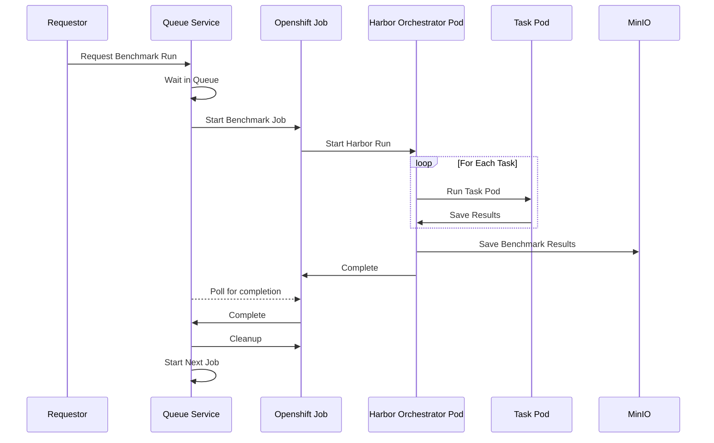

# Queue Service

The queue service is a FastAPI application that can be deployed on OpenShift to queue and run benchmarks automatically.
Benchmark results are stored to MinIO for later review.

```mermaid
sequenceDiagram
    Requestor->>Queue Service: Request Benchmark Run
    Queue Service->>Queue Service: Wait in Queue
    Queue Service->>Openshift Job: Start Benchmark Job
    Openshift Job->>Harbor Orchestrator Pod: Start Harbor Run
    loop For Each Task
        Harbor Orchestrator Pod->>Task Pod: Run Task Pod
        Task Pod->>Harbor Orchestrator Pod: Save Results
    end
    Harbor Orchestrator Pod->>MinIO: Save Benchmark Results
    Harbor Orchestrator Pod->>Openshift Job: Complete
    Queue Service-->>Openshift Job: Poll for completion
    Openshift Job->>Queue Service: Complete
    Queue Service->>Openshift Job: Cleanup
    Queue Service->>Queue Service: Start Next Job
```
