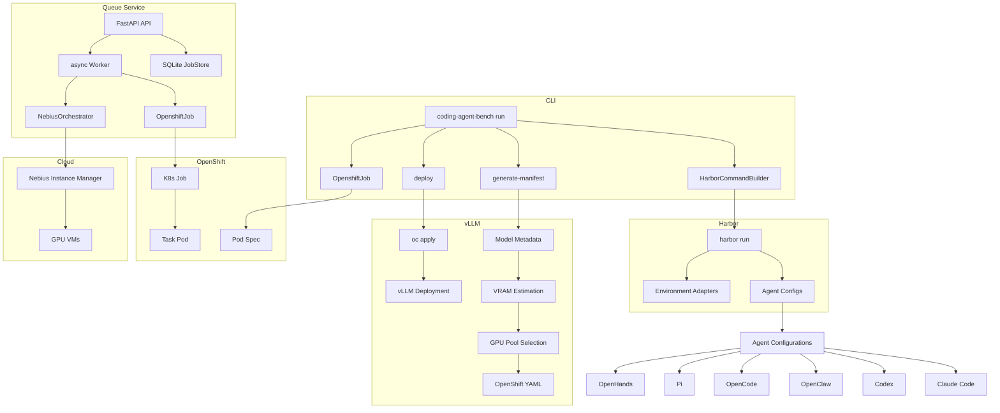
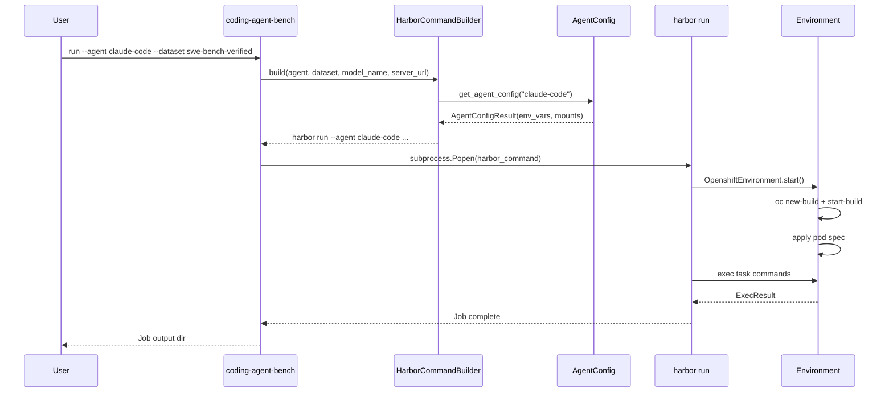
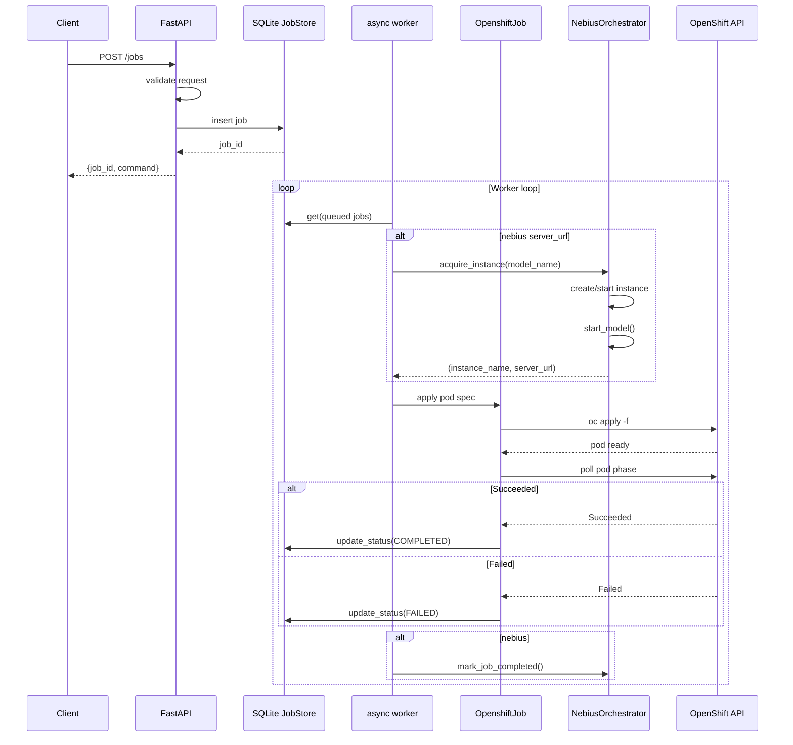

# Architecture Overview

Coding Agent Bench is a multi-component system for benchmarking AI coding agents. It consists of four major subsystems:

## System Components

## Data Flow

### CLI Benchmark Run

### Queue Service Job

## Key Design Decisions

1. **Harbor as orchestrator**: The project delegates task execution to [Harbor](https://github.com/redhat-et/harbor), a benchmarking framework. This library focuses on agent configuration, job orchestration, and deployment tooling.

2. **Pluggable agent configs**: Each coding agent (Claude Code, Codex, OpenClaw, etc.) has its own `AgentConfig` subclass that produces agent-specific environment variables, model names, and volume mounts.

3. **Environment adapters**: Harbor's `BaseEnvironment` is extended for OpenShift (`OpenshiftEnvironment`) and Podman (`PodmanEnvironment`), allowing Harbor to run tasks in different container runtimes.

4. **Manifest automation**: The `manifest.py` module fetches HuggingFace model metadata, estimates VRAM requirements, selects GPU pools, and generates complete OpenShift YAML manifests — no manual configuration needed.

5. **Queue service**: A FastAPI application with SQLite persistence provides a REST API for queuing benchmark jobs, with an async worker that manages OpenShift Job lifecycle and optional Nebius GPU provisioning.

## Evidence

- Source: `src/coding_agent_bench/`, `Containerfile`, `deploy/`
- Orchestration: [Harbor framework](https://github.com/redhat-et/harbor)
- Deployment: OpenShift with vLLM
