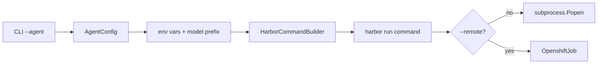

# CLI Tool

The `coding-agent-bench` CLI is the primary user-facing interface, built with [Typer](https://typer.tiangolo.com/). It provides three main commands:

## Commands

### `run` — Execute a Benchmark

```bash
coding-agent-bench run \
    --agent <agent> \
    --dataset <benchmark-name> \
    --model-name <model-name> \
    --server-url <server-url> \
    [--environment docker|openshift] \
    [--job-name <name>] \
    [--dry-run] \
    [--remote]
```

**Parameters:**

| Parameter | Required | Description |
|-----------|----------|-------------|
| `--agent` | Yes | Agent type: `oracle`, `claude-code`, `codex`, `openclaw`, `opencode`, `pi` |
| `--dataset` | Yes | Dataset name or path (e.g., `swe-bench/swe-bench-verified` or local path) |
| `--model-name` | Yes | Model name (e.g., `qwen3.6-35b`) |
| `--server-url` | Yes | Model server URL (e.g., `http://my.server.url` or `nebius` for auto-provisioning) |
| `--environment` | No | Runtime environment: `docker` (default) or `openshift` |
| `--job-name` | No | Name for the job output directory (default: `default`) |
| `--dataset-pattern` | No | Glob pattern to filter dataset tasks |
| `--n-concurrent` | No | Number of concurrent tasks (default: 1) |
| `--n-tasks` | No | Total number of tasks to run |
| `--model-max-len` | No | Maximum context length in tokens (default: 262000) |
| `--remote` | No | Run on remote OpenShift (requires `--environment=openshift`) |
| `--before-script` | No | Shell command to run before the job (remote only) |
| `--agent-version` | No | Pin agent to specific version (overrides `agent_versions.toml`) |
| `--dry-run` | No | Preview the Harbor command without executing |

**Modes:**

- **Local mode** (default): Builds a Harbor command via `HarborCommandBuilder`, prints it, and executes it via `subprocess.Popen`. Handles `SIGINT` gracefully with timeout-based cleanup.
- **Remote mode** (`--remote`): Creates an `OpenshiftJob` that runs the command inside an OpenShift Job pod. Requires `oc` CLI and login.

**Environment mapping:**



### `generate-manifest` — Generate vLLM Deployment YAML

```bash
coding-agent-bench generate-manifest <model-id> \
    [--reasoning-parser parser] \
    [--tool-call-parser parser] \
    [--chat-template-kwargs json] \
    [--vllm-arg arg] \
    [--gpu-pool pool] \
    [--gpu-pools-file path] \
    [--max-model-len len] \
    [--namespace ns] \
    [--vllm-image image] \
    [--route-timeout timeout] \
    [-o output.yml] \
    [--dry-run] \
    [--anyuid] \
    [--before-script script]
```

Fetches model metadata from HuggingFace, estimates VRAM, selects GPU pool, and outputs OpenShift YAML. See [Manifest Generation](/deployment/manifest-generation.md) for details.

### `deploy` — Deploy, Validate, Manage vLLM

```bash
coding-agent-bench deploy <model-id> \
    [--reasoning-parser parser] \
    [--tool-call-parser parser] \
    [--chat-template-kwargs json] \
    [--vllm-arg arg] \
    [--anyuid] \
    [--scale-down] \
    [--teardown] \
    [--skip-validation] \
    [--health-timeout seconds]
```

End-to-end deployment: generates manifest, applies it, waits for health check, and validates the model server. See [Deploy Command](/deployment/deploy-command.md) for details.

## Entry Point

```python
# pyproject.toml
[project.scripts]
coding-agent-bench = "coding_agent_bench.cli:app"
```

```python
# cli.py
app = typer.Typer()
```

## Evidence

- Source: `src/coding_agent_bench/cli.py`
- Entry point: `coding_agent_bench.cli:app`
- Dependencies: `typer`, `coding_agent_bench.builder.HarborCommandBuilder`, `coding_agent_bench.job.OpenshiftJob`, `coding_agent_bench.manifest`
