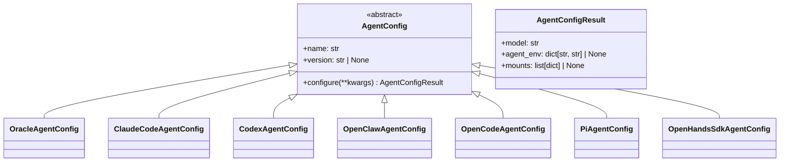

# Agent Configuration System

The agent configuration system provides a pluggable hierarchy for configuring each supported coding agent. Each agent has an `AgentConfig` subclass that produces agent-specific environment variables, model names, and volume mounts.

## Architecture



## Base Classes

### `AgentConfig` (Abstract)

```python
class AgentConfig(ABC):
    name: str
    version: str | None = None
    
    @abstractmethod
    def configure(self, **kwargs) -> AgentConfigResult:
        """Return agent-specific model, env vars, and mounts."""
```

### `AgentConfigResult` (Dataclass)

```python
@dataclass
class AgentConfigResult:
    model: str
    agent_env: dict[str, str] | None = None
    mounts: list[dict[str, Any]] | None = None
```

## Agent Implementations

### OracleAgentConfig

```python
class OracleAgentConfig(AgentConfig):
    name = "oracle"
    version = None  # No version pinning
    
    def configure(self, **kwargs):
        return AgentConfigResult(model=kwargs["model_name"])
```

Non-LLM oracle agent. Passes the model through with no extra configuration.

### ClaudeCodeAgentConfig

```python
class ClaudeCodeAgentConfig(AgentConfig):
    name = "claude-code"
    version = "2.1.220"
    
    def configure(self, **kwargs):
        model_name = kwargs["model_name"]
        server_url = kwargs["server_url"]
        agent_env = {
            "ANTHROPIC_BASE_URL": server_url,
            "ANTHROPIC_API_KEY": "sk-no-key-required",
            "ANTHROPIC_MODEL": model_name,
            "ANTHROPIC_DEFAULT_OPUS_MODEL": model_name,
            "ANTHROPIC_DEFAULT_SONNET_MODEL": model_name,
            "ANTHROPIC_DEFAULT_HAIKU_MODEL": model_name,
        }
        return AgentConfigResult(model=model_name, agent_env=agent_env)
```

Configures Anthropic API env vars pointing at the served model. No model prefix — uses the raw model name.

### CodexAgentConfig

```python
class CodexAgentConfig(AgentConfig):
    name = "codex"
    version = "0.145.0"
    
    def configure(self, **kwargs):
        model_name = kwargs["model_name"]
        server_url = kwargs["server_url"]
        
        # Generate config.toml
        outpath = Path("config.toml").absolute()
        codex_create_toml(model_name, server_url, outpath)
        
        mounts = [{
            "type": "bind",
            "source": str(outpath),
            "target": "/root/.codex/config.toml",
        }]
        
        return AgentConfigResult(
            model="vllm/" + model_name,
            agent_env={"CODEX_HOME": "/root/.codex/"},
            mounts=mounts,
        )
```

Generates a `config.toml` file and bind-mounts it into the container. Uses `vllm/` model prefix and sets `CODEX_HOME`.

### OpenClawAgentConfig

```python
class OpenClawAgentConfig(AgentConfig):
    name = "openclaw"
    version = "2026.6.1"
    
    def configure(self, **kwargs):
        model_name = kwargs["model_name"]
        server_url = kwargs["server_url"]
        agent_env = {
            "OPENAI_BASE_URL": server_url.rstrip("/").removesuffix("/v1") + "/v1",
            "OPENAI_API_KEY": "sk-no-key-required",
        }
        return AgentConfigResult(model="vllm/" + model_name, agent_env=agent_env)
```

Configures OpenAI-compatible API env vars. Uses `vllm/` model prefix. Normalizes server URL to ensure `/v1` suffix.

### OpenCodeAgentConfig

```python
class OpenCodeAgentConfig(AgentConfig):
    name = "opencode"
    version = "1.18.1"
    
    def configure(self, **kwargs):
        model_name = kwargs["model_name"]
        server_url = kwargs["server_url"]
        model_max_len = kwargs.get("model_max_len", 262000)
        
        model = "vllm/" + model_name
        context_limit = int(model_max_len * 0.75)
        output_limit = int(model_max_len * 0.25)
        
        opencode_config = {
            "$schema": "https://opencode.ai/config.json",
            "model": model,
            "provider": {
                "vllm": {
                    "npm": "@ai-sdk/openai-compatible",
                    "name": "vLLM",
                    "options": {"baseURL": normalized_url},
                    "models": {
                        "qwen3.6-35b": {
                            "name": "qwen3.6-35b",
                            "limit": {"context": context_limit, "output": output_limit},
                        }
                    },
                }
            },
        }
        
        agent_env = {
            "OPENCODE_CONFIG_CONTENT": json.dumps(opencode_config),
        }
        return AgentConfigResult(model=model, agent_env=agent_env)
```

Builds a JSON config with vLLM provider and context/output limits. Context limit is 75% of max_len, output limit is 25%. Config is passed via `OPENCODE_CONFIG_CONTENT` environment variable.

### PiAgentConfig

```python
class PiAgentConfig(AgentConfig):
    name = "pi"
    version = "0.73.1"
    
    def configure(self, **kwargs):
        model_name = kwargs["model_name"]
        server_url = kwargs["server_url"]
        model_max_len = kwargs.get("model_max_len", 262000)
        
        models_json = {
            "providers": {
                "vllm": {
                    "baseUrl": normalized_url,
                    "api": "openai-completions",
                    "apiKey": "NONE",
                    "models": [{
                        "id": model_name,
                        "name": model_name,
                        "contextWindow": model_max_len,
                    }],
                }
            }
        }
        
        tmp = Path("models.json").absolute()
        with open(tmp, "w") as f:
            json.dump(models_json, f)
        
        mounts = [{
            "type": "bind",
            "source": str(tmp),
            "target": "/root/.pi/agent/models.json",
        }]
        
        agent_env = {
            "PI_OFFLINE": "1",
            "PI_CODING_AGENT_DIR": "/root/.pi/agent",
        }
        return AgentConfigResult(model="vllm/" + model_name, agent_env=agent_env, mounts=mounts)
```

Generates a `models.json` file and bind-mounts it into the container. Uses `vllm/` model prefix. Sets offline mode and coding agent directory.

### OpenHandsSdkAgentConfig

```python
class OpenHandsSdkAgentConfig(AgentConfig):
    name = "openhands-sdk"
    
    def configure(self, **kwargs):
        model_name = kwargs["model_name"]
        server_url = kwargs["server_url"]
        
        os.environ["LLM_API_KEY"] = "NONE"
        model = "hosted_vllm/" + model_name
        api_base = server_url.rstrip("/").removesuffix("/v1") + "/v1"
        
        agent_env = {
            "HOSTED_VLLM_API_BASE": api_base,
        }
        return AgentConfigResult(model=model, agent_env=agent_env)
```

Sets environment variables for a vLLM provider. Uses `hosted_vllm/` model prefix.

## Registry

```python
# agents/__init__.py
AGENT_CONFIGS: list[type[AgentConfig]] = [
    OracleAgentConfig,
    ClaudeCodeAgentConfig,
    CodexAgentConfig,
    OpenClawAgentConfig,
    OpenCodeAgentConfig,
    PiAgentConfig,
]

AGENT_REGISTRY: dict[str, AgentConfig] = {cls.name: cls() for cls in AGENT_CONFIGS}

def get_agent_config(name: str) -> AgentConfig:
    config = AGENT_REGISTRY.get(name)
    if config is None:
        raise ValueError(f"Unsupported agent type '{name}'. Choose from: {list(AGENT_REGISTRY.keys())}")
    return config
```

## Adding a New Agent

To add a new agent:

1. Create a subclass of `AgentConfig` in `agents/configs.py`
2. Set `name` (used as CLI identifier) and optionally `version`
3. Implement `configure(**kwargs)` returning `AgentConfigResult`
4. Add the class to `AGENT_CONFIGS` list in `agents/__init__.py`

## Evidence

- Source: `src/coding_agent_bench/agents/base.py`, `src/coding_agent_bench/agents/configs.py`, `src/coding_agent_bench/agents/__init__.py`
- Used by: `HarborCommandBuilder._build_command()` via `get_agent_config()`
- Extension point: Subclass `AgentConfig` and add to `AGENT_CONFIGS`
