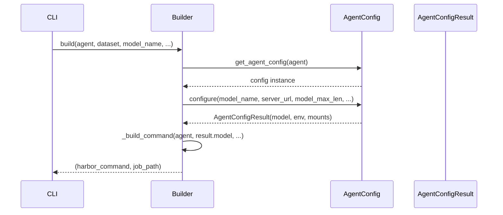

# Harbor Command Builder

The `HarborCommandBuilder` constructs `harbor run` commands for supported coding agents. It combines agent-specific configuration (from `AgentConfig` subclasses) with Harbor CLI arguments to produce the final command string.

## Class Definition

```python
class HarborCommandBuilder:
    def __init__(self):
        self.jobs_dir = Path(os.getcwd()) / "jobs"

    def build(
        self,
        agent: str,
        dataset: str,
        model_name: str,
        server_url: str,
        environment: Literal["docker", "openshift"],
        dataset_pattern: str = None,
        n_concurrent: int = 1,
        n_tasks: int = None,
        model_max_len: int = 262000,
        job_name: str = "default",
        agent_version: str = None,
        **kwargs,
    ) -> tuple[list[str], Path]:
        """Build and return (harbor_command, job_path)."""
```

## Build Flow



## `_build_command` Construction

The method assembles a `harbor run` command with the following argument groups:

### Agent Selection

```
--agent <agent>
--ak version=<version>  # if agent_version is set (from config or override)
```

Version pinning: `agent_version` CLI override > `agent_config.version` > none. Special value `"latest"` skips pinning.

### Dataset Selection

```
-p <path>  # if Path(dataset).exists()
-d <name>  # otherwise (Harbor Hub dataset identifier)
-i <pattern>  # optional include filter
```

### Model Configuration

```
--model <result.model>  # agent-specific model name (may have prefix like "vllm/")
```

### Agent Environment Variables

```
--ae KEY=VALUE  # one per key in result.agent_env
```

These are passed to Harbor as `--ae` flags and injected into the task environment.

### Environment Selection

```
--env docker|openshift  # standard environments
--environment-import-path coding_agent_bench.harbor_envs.openshift:OpenshiftEnvironment  # for custom openshift
```

### Mounts

```
--mounts-json <json>  # agent-specific volume mounts (e.g., Codex config.toml, Pi models.json)
```

### Task Limits

```
--n-concurrent <n>
--n-tasks <n>  # optional
--job-name <name>  # optional
```

## Supported Agents

| Agent | Model Prefix | Version | Mounts |
|-------|-------------|---------|--------|
| `oracle` | none | — | — |
| `claude-code` | none | 2.1.220 | — |
| `codex` | `vllm/` | 0.145.0 | `config.toml` → `/root/.codex/config.toml` |
| `openclaw` | `vllm/` | 2026.6.1 | — |
| `opencode` | `vllm/` | 1.18.1 | — (env var config) |
| `pi` | `vllm/` | 0.73.1 | `models.json` → `/root/.pi/agent/models.json` |
| `openhands-sdk` | `hosted_vllm/` | — | — |

## Job Path

Output directory: `<cwd>/jobs/<job_name>/`

## Evidence

- Source: `src/coding_agent_bench/builder.py`
- Used by: `cli.py:run()`, `api.py:create_job()`
- Dependencies: `coding_agent_bench.agents.get_agent_config()`, `harbor.models.environment_type.EnvironmentType`
