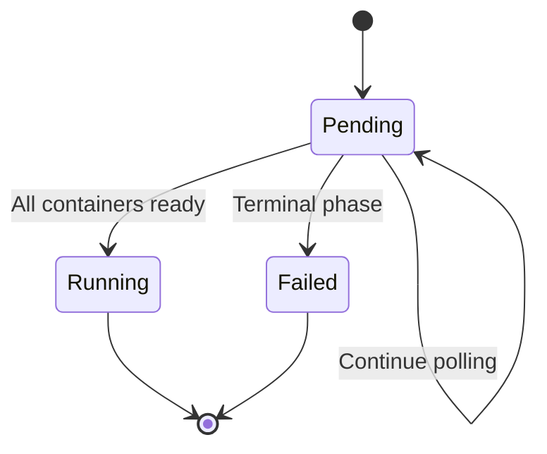
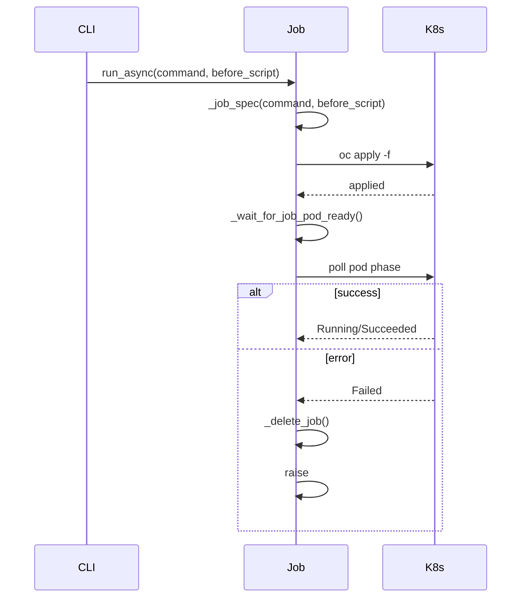

# Job Orchestration

The `OpenshiftJob` class manages the lifecycle of OpenShift Jobs that run benchmark tasks remotely. It handles pod spec generation, job creation, status polling, and cleanup.

## Class Definition

```python
class OpenshiftJob:
    def __init__(self, job_name: str):
        self._job_name = job_name
        self._pod_name = f"coding-agent-bench--{self._job_name}"[:58]
```

Job names are truncated to 58 characters to comply with K8s naming limits.

## Key Methods

### `preflight()` (Class Method)

Validates the OpenShift CLI is available and the user is logged in:

```python
@classmethod
def preflight(cls) -> None:
    if not shutil.which("oc"):
        raise SystemExit("oc CLI is not installed...")
    subprocess.run(["oc", "whoami"], check=True, timeout=10)
```

### `_job_spec(command, before_script)`

Builds a Kubernetes Job spec for running a Harbor benchmark:

```python
def _job_spec(self, command: list[str], before_script: list[str] = None) -> dict:
    return {
        "apiVersion": "batch/v1",
        "kind": "Job",
        "metadata": {
            "name": self._pod_name,
            "labels": {"app": "harbor"},
        },
        "spec": {
            "template": {
                "spec": {
                    "restartPolicy": "Never",
                    "serviceAccountName": "harbor-orchestrator",
                    "volumes": [{"name": "jobs", "type": "emptyDir"}],
                    "containers": [{
                        "name": "harbor",
                        "image": "ghcr.io/redhat-et/coding_agent_bench:latest",
                        "imagePullPolicy": "Always",
                        "command": ["sh", "-c"],
                        "args": [
                            # before_script (if provided)
                            # uv run --no-sync --no-cache harbor run ...
                            # mc alias set minio ...
                            # mc mb --ignore-existing minio/results
                            # mc cp --recursive /app/jobs/ minio/results/
                        ],
                        "volumeMounts": [{"name": "jobs", "mountPath": "/app/jobs"}],
                        "envFrom": [{"secretRef": {"name": "harbor-minio"}}],
                    }],
                }
            }
        },
    }
```

The container runs:
1. Optional `before_script`
2. `uv run --no-sync --no-cache harbor run ...` (the benchmark command)
3. MinIO setup and result upload

### `_resume_job_spec(shell_command)`

Builds a Job spec for resuming failed tasks from a previous run. Uses a raw shell command instead of the full Harbor command.

### `_run_oc_command(command, check, timeout_sec, stdin_data)`

Async wrapper around `oc` CLI commands with timeout handling:

```python
async def _run_oc_command(self, command, check=True, timeout_sec=None, stdin_data=None):
    full_command = ["oc"] + command
    process = await asyncio.create_subprocess_exec(
        *full_command,
        stdin=asyncio.subprocess.PIPE if stdin_data else asyncio.subprocess.DEVNULL,
        stdout=asyncio.subprocess.PIPE,
        stderr=asyncio.subprocess.PIPE,
    )
    # Timeout handling with terminate → kill cascade
    # Return (stdout, stderr) tuple
```

### `_wait_for_job_pod_ready(timeout_sec=300)`

Polls for the job pod to reach `Running` state with all containers ready:



Checks for:
- `Running` with all containers ready → success
- `Succeeded` → success
- `Failed`, `Unknown`, `Error` → raise `RuntimeError`
- `Pending` with `ImagePullBackOff`/`ErrImagePull` → raise `RuntimeError`

### `_signal_job_pod()`

Sends `SIGTERM` to the harbor process inside the job pod, then waits up to 60 seconds for the pod to reach a terminal phase.

### `_delete_harbor_pods()`

Deletes all pods spawned by harbor with selector `harbor-parent=<pod_name>`.

### `_delete_job()`

Deletes the job with `--cascade=foreground` and then cleans up harbor pods.

### `run(command, before_script)`

Synchronous entry point that runs `run_async()` in an event loop.

### `run_async(command, before_script)`

Asynchronous job execution:



## Signal Handling (CLI)

The CLI wraps `OpenshiftJob.run()` with keyboard interrupt handling:

```python
try:
    job.run(command, _before_script)
except KeyboardInterrupt:
    typer.echo("\nInterrupted — cleaning up remote job...")
    job.cleanup()
    raise SystemExit(130)
```

## Evidence

- Source: `src/coding_agent_bench/job.py`
- Used by: `cli.py:run()` (remote mode), `api.py:_run_job()`
- Container image: `ghcr.io/redhat-et/coding_agent_bench:latest`
- Service account: `harbor-orchestrator`
