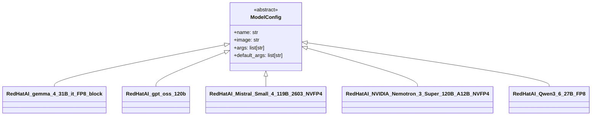

# Model Configuration System

The model configuration system provides predefined vLLM configurations for supported models. Each `ModelConfig` subclass specifies the model ID, vLLM startup arguments, and default flags.

## Architecture



## Base Class

```python
class ModelConfig(ABC):
    name: str
    image: str = "vllm/vllm-openai:v0.24.0"
    args: list[str]
    default_args: list[str] = [
        "--gpu-memory-utilization", "0.9",
        "--async-scheduling",
        "--enable-chunked-prefill",
        "--enable-prefix-caching",
    ]
```

## Model Implementations

### RedHatAI_gemma_4_31B_it_FP8_block

- **Model ID**: `RedHatAI/gemma-4-31B-it-FP8-block`
- **Reasoning parser**: `gemma4`
- **Tool-call parser**: `gemma4`
- **Chat template kwargs**: `{"enable_thinking": true}`
- **Trust remote code**: Yes

### RedHatAI_gpt_oss_120b

- **Model ID**: `RedHatAI/gpt-oss-120b`
- **KV cache dtype**: `fp8`
- **Tool-call parser**: `openai`

### RedHatAI_Mistral_Small_4_119B_2603_NVFP4

- **Model ID**: `RedHatAI/Mistral-Small-4-119B-2603-NVFP4`
- **Max model len**: 131072
- **Reasoning parser**: `mistral`
- **Tool-call parser**: `mistral`
- **Chat template kwargs**: `{"reasoning_effort": "high"}`
- **Limit MM per prompt**: `{"image": 0}`
- **Trust remote code**: Yes

### RedHatAI_NVIDIA_Nemotron_3_Super_120B_A12B_NVFP4

- **Model ID**: `RedHatAI/NVIDIA-Nemotron-3-Super-120B-A12B-NVFP4`
- **Tensor parallel size**: 1
- **Reasoning parser**: `nemotron_v3`
- **Tool-call parser**: `qwen3_coder`
- **KV cache dtype**: `fp8`

### RedHatAI_Qwen3_6_27B_FP8

- **Model ID**: `RedHatAI/Qwen3.6-27B-FP8`
- **Max model len**: 131072
- **Reasoning parser**: `qwen3`
- **Tool-call parser**: `qwen3_coder`
- **Chat template kwargs**: `{"enable_thinking": true}`
- **Trust remote code**: Yes

## Registry

```python
# models/__init__.py
MODEL_CONFIGS: list[type[ModelConfig]] = [
    RedHatAI_gemma_4_31B_it_FP8_block,
    RedHatAI_gpt_oss_120b,
    RedHatAI_Mistral_Small_4_119B_2603_NVFP4,
    RedHatAI_NVIDIA_Nemotron_3_Super_120B_A12B_NVFP4,
    RedHatAI_Qwen3_6_27B_FP8,
]

MODEL_REGISTRY: dict[str, ModelConfig] = {cls.name: cls() for cls in MODEL_CONFIGS}

def get_model_config(name: str) -> ModelConfig:
    config = MODEL_REGISTRY.get(name)
    if config is None:
        raise ValueError(f"Unsupported model type '{name}'. Choose from: {list(MODEL_REGISTRY.keys())}")
    return config
```

## Usage

Model configs are primarily used by the manifest generation system to determine vLLM-specific arguments. They are looked up by model name when generating deployment manifests.

## Evidence

- Source: `src/coding_agent_bench/models/base.py`, `src/coding_agent_bench/models/configs.py`, `src/coding_agent_bench/models/__init__.py`
- Used by: Manifest generation, deploy command
- Extension point: Subclass `ModelConfig` and add to `MODEL_CONFIGS`
