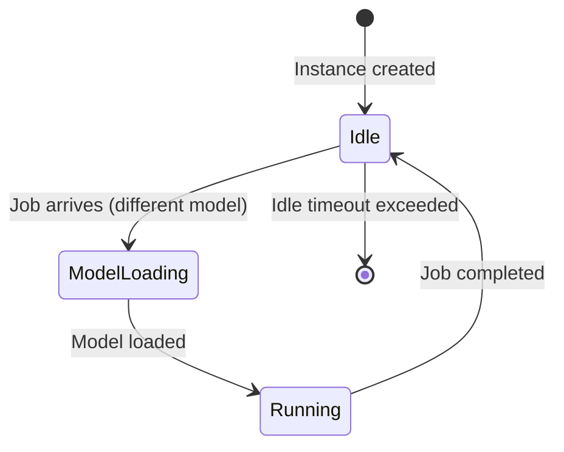
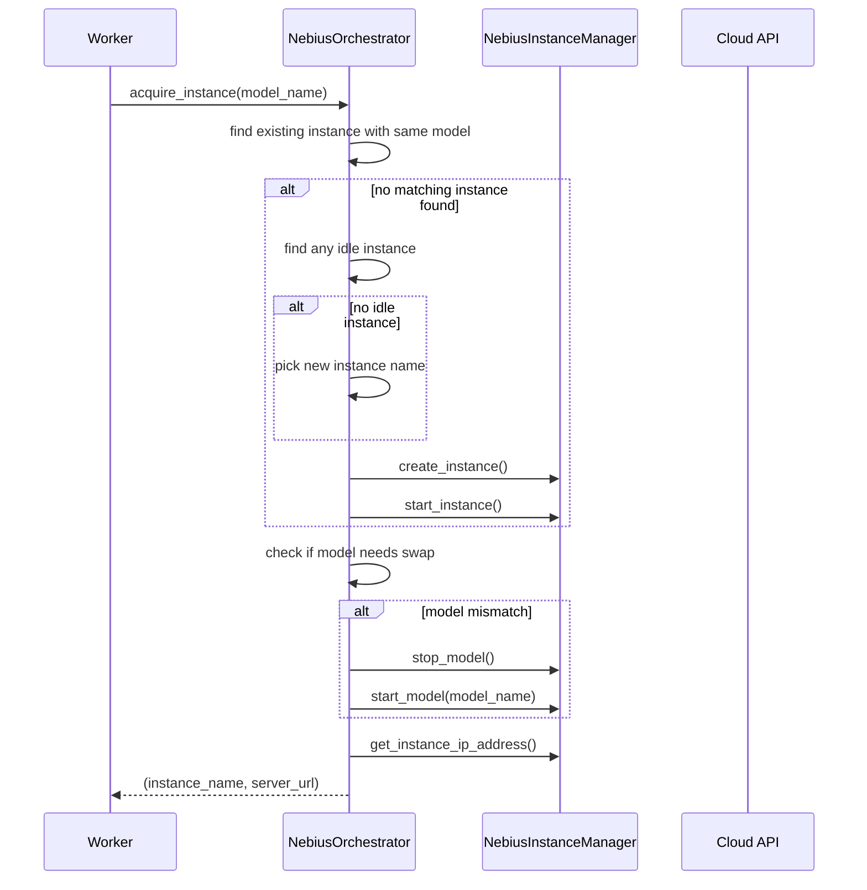

# Nebius Cloud Integration

Nebius integration provides cloud GPU instance management for automatically provisioning and managing model servers on Nebius AI Cloud. It consists of two main components:

1. **`NebiusInstanceManager`** — Low-level CLI wrapper for Nebius operations
2. **`NebiusOrchestrator`** (in `api.py`) — High-level async lifecycle manager used by the queue service

## NebiusInstanceManager

```
src/coding_agent_bench/nebius_utils.py
```

### Construction Parameters

| Parameter | Description |
|-----------|-------------|
| `credentials_path` | Service account credentials JSON file |
| `user` | SSH user for instance access |
| `ssh_public_key_path` | Public SSH key |
| `ssh_private_key_path` | Private SSH key |
| `parent_id` | Nebius parent ID (organization/project) |
| `tenant_id` | Nebius tenant ID |
| `service_account_id` | Service account ID |

### Core Methods

| Method | Description |
|--------|-------------|
| `init()` | Creates the default CLI profile |
| `exec(args)` | Executes a `nebius` CLI command |
| `create_instance(name, subnet_id, gpu_config)` | Creates a compute instance with cloud-init user data |
| `get_instance(name)` | Gets instance details as JSON |
| `get_instance_ip_address(name)` | Extracts public IP address |
| `start_instance(name)` | Starts a STOPPED/STOPPING instance |
| `stop_instance(name)` | Stops a RUNNING instance |
| `delete_instance(name)` | Stops (if running) and deletes |
| `instance_exec(name, command, exit_after, retries, retry_delay)` | SSH into instance and execute command with retry |

### GPU Resource Configurations

| Config | Platform | Preset | Additional Args |
|--------|----------|--------|-----------------|
| `B200` | `gpu-b200-sxm` | `1gpu-20vcpu-224gb` | `--preemptible-on-preemption stop` |
| `H200` | `gpu-h200-sxm` | `1gpu-16vcpu-200gb` | — |

### Instance Creation Details

- **Boot disk**: 1.2 TB network SSD, 4 KiB block size
- **Base image**: `ubuntu24.04-cuda13.0` family
- **Network**: Single interface with public IP
- **Reservation policy**: `forbid` (no preemption)
- **Cloud-init**: Creates sudo user with SSH key auth

### SSH Execution with Retry

`instance_exec()` retries SSH connections up to 5 times with 10-second delays, handling the common case where the VM starts but SSHD isn't ready yet. `CancelledError` is always re-raised immediately to avoid blocking shutdown.

## NebiusOrchestrator

```
src/coding_agent_bench/api.py (async wrapper)
```

The queue service wraps `NebiusInstanceManager` in an async orchestrator that manages instance lifecycle alongside job execution:



### State Tracking

`NebiusInstanceState` dataclass tracks:
- `instance_name` — unique identifier
- `current_model` — model currently loaded (or `None`)
- `provisioning_model` — model being swapped in (set during swap)
- `job_running` — whether a job is actively using this instance
- `last_job_completed_at` — timestamp for idle cleanup

### Instance Acquisition Flow



### Queue Reordering

When Nebius is enabled, `_reorder_queue_for_nebius()` sorts the job queue so that jobs matching the currently loaded model come first, minimizing expensive model swaps.

### Idle Cleanup Loop

Runs every 60 seconds, deleting instances where:
- No job is running
- Last job completed more than `NEBIUS_IDLE_TIMEOUT_SECONDS` (default: 600s) ago

### Lifecycle Integration

The orchestrator is initialized in the FastAPI `lifespan()` and started as a background task. On shutdown, all tasks are cancelled gracefully.

## Environment Variables

| Variable | Default | Description |
|----------|---------|-------------|
| `NEBIUS_ENABLED` | — | Set to `1` to enable Nebius |
| `NEBIUS_SERVICE_ACCOUNT_CREDS_PATH` | — | Path to service account credentials |
| `NEBIUS_USER` | — | SSH user |
| `NEBIUS_SSH_PUBLIC_KEY_PATH` | — | Public SSH key path |
| `NEBIUS_SSH_PRIVATE_KEY_PATH` | — | Private SSH key path |
| `NEBIUS_PARENT_ID` | — | Nebius parent ID |
| `NEBIUS_TENANT_ID` | — | Nebius tenant ID |
| `NEBIUS_SERVICE_ACCOUNT_ID` | — | Service account ID |
| `NEBIUS_SUBNET_ID` | — | Subnet for instances |
| `NEBIUS_GPU_CONFIG` | `h200` | GPU preset (b200 or h200) |
| `NEBIUS_INSTANCE_NAME_PREFIX` | `cab-worker` | Instance name prefix |
| `NEBIUS_IDLE_TIMEOUT_SECONDS` | `600` | Idle cleanup timeout |

## Evidence

- Source: `src/coding_agent_bench/nebius_utils.py` (manager), `src/coding_agent_bench/api.py` (orchestrator)
- Used by: `_worker()` in `api.py` for `server_url == "nebius"` jobs
