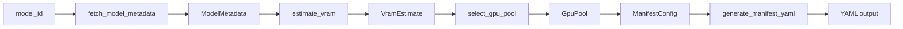

# Manifest Generation

Automated vLLM deployment manifest generation that fetches model metadata from HuggingFace, estimates VRAM requirements, selects appropriate GPU pools, and produces a complete OpenShift YAML manifest.

## Entry Point

```
src/coding_agent_bench/manifest.py:generate()
```

CLI command: `uv run coding-agent-bench generate-manifest <model-id> [options]`

## Pipeline



## Step 1: Fetch Model Metadata

```python
def fetch_model_metadata(model_id: str) -> ModelMetadata
```

Uses `huggingface_hub.HfApi` to:
1. Download `config.json` from the model repository
2. Get safetensors metadata (parameter counts, dtypes)
3. Calculate total parameters and weight size in GB

### `ModelMetadata`

```python
@dataclass
class ModelMetadata:
    model_id: str
    parameter_count: dict[str, int]  # e.g., {"FP8_E4M3": 1000000000, "FP16": 500000}
    config: dict
    weight_size_gb: float
    total_params: int
```

**Computed properties:**
- `max_position_embeddings` — from `text_config.max_position_embeddings`
- `num_hidden_layers` — from `text_config.num_hidden_layers` or `len(text_config.layers_block_type)`
- `num_key_value_heads` — from `text_config.num_key_value_heads`
- `head_dim` — from `text_config.head_dim` or `hidden_size // num_attention_heads`
- `sliding_window` — from `text_config.sliding_window`
- `layer_types` — per-layer attention type list (e.g., Gemma's mix of sliding/full)
- `global_head_dim` — from `text_config.global_head_dim`
- `num_global_key_value_heads` — from `text_config.num_global_key_value_heads`

## Step 2: Estimate VRAM

```python
def estimate_vram(metadata: ModelMetadata, max_model_len: int | None) -> VramEstimate
```

Calculates:
- **Weight size**: `metadata.weight_size_gb`
- **Overhead**: `weight_gb * 0.15` (15% for CUDA context, activations, CUDA graphs)
- **KV cache**: Estimated per-layer, accounting for sliding window attention
- **Minimum VRAM**: `weight_gb + overhead_gb + kv_cache_gb`

### KV Cache Estimation

```python
def _estimate_kv_cache_bytes(metadata, max_model_len) -> float | None
```

Uses FP8 KV cache (1 byte per element). Handles:
- **Sliding window attention**: Only stores KV entries for the window size
- **Heterogeneous layer types** (e.g., Gemma): Per-layer-group calculation with different head dims for full vs. sliding attention
- **Full context**: Uses `max_model_len` when no sliding window

Formula: `2 * n_kv_heads * head_dim * n_layers * kv_dtype_bytes * tokens`

### `VramEstimate`

```python
@dataclass
class VramEstimate:
    weight_gb: float
    overhead_gb: float
    kv_cache_gb: float
    min_vram_gb: float
```

## Step 3: Select GPU Pool

```python
def select_gpu_pool(vram_needed: float, pools: dict[str, GpuPool], override: str | None = None) -> GpuPool
```

Finds the smallest GPU pool that fits the model:

1. If `override` is specified, uses that pool (with a warning if tight fit)
2. Otherwise, sorts pools by total VRAM and picks the first where `total_vram * 0.9 >= vram_needed`
3. If no pool fits but the largest has ≥85% capacity, warns and returns it
4. If no pool can fit, raises `ValueError`

### `GpuPool`

```python
@dataclass
class GpuPool:
    name: str
    label: str  # e.g., "gpu-pool-size=small"
    gpus: int
    gpu_model: str
    vram_per_gpu: int  # GB
```

**Built-in pools:**

| Pool | GPUs | Model | VRAM/GPU | Total VRAM | Label |
|------|------|-------|----------|------------|-------|
| `small` | 1 | L40S | 48 GB | 48 GB | `gpu-pool-size=small` |
| `large` | 4 | L4 | 23 GB | 92 GB | `gpu-pool-size=large` |
| `xlarge` | 4 | L40S | 48 GB | 192 GB | `gpu-pool-size=xlarge` |

### Custom GPU Pools

```python
def load_gpu_pools(pools_file: Path | None) -> dict[str, GpuPool]
```

Loads from a YAML file with format:

```yaml
pools:
  small:
    label: "gpu-pool-size=small"
    gpus: 1
    gpu_model: "L40S"
    vram_per_gpu: 48
```

## Step 4: Build Manifest Config

```python
@dataclass
class ManifestConfig:
    model_id: str
    app_name: str
    served_model_name: str
    namespace: str
    gpu_pool: GpuPool
    tensor_parallel_size: int
    max_model_len: int | None
    pvc_size: str
    vllm_image: str
    route_timeout: str
    vllm_serve_args: list[str] = field(default_factory=list)
    anyuid: bool = False
    before_script: str | None = None
    gpu_memory_utilization: float = 0.9
    cpu_request: str = "2"
    cpu_limit: str = "4"
    memory_request: str = "20G"
    memory_limit: str = "30G"
    shm_size: str = "16Gi"
```

## Step 5: Generate YAML

```python
def generate_manifest_yaml(cfg: ManifestConfig) -> str
```

Produces a multi-document YAML with these resources (in order):

1. **ServiceAccount** — vLLM pod identity
2. **RoleBinding** (optional, `anyuid=True`) — anyuid SCC for vLLM >v0.22
3. **PersistentVolumeClaim** — model weight storage (`determine_pvc_size(weight_gb)`)
4. **Deployment** — vLLM container with:
   - GPU nodeSelector from pool label
   - Startup probe: 1800s initial delay, 30s period, 10 failure threshold
   - Readiness probe: 10s period
   - Liveness probe: 30s period
   - Resource limits: CPU, memory, GPU count
   - Volume mounts: PVC (cache), emptyDir (config, local, triton), shm
   - Security context: `runAsUser: 2000`, `allowPrivilegeEscalation: false`
5. **Service** — ClusterIP port 80 → 8000
6. **Route** — HTTPS with edge termination, HAProxy timeout

### PVC Size Calculation

```python
def determine_pvc_size(weight_gb: float) -> str
```

`max(100, ceil(weight_gb * 1.5 / 50) * 50)Gi` — rounded up to nearest 50 Gi, minimum 100 Gi.

### App Name Derivation

```python
def derive_app_name(model_id: str, override: str | None = None) -> str
def derive_served_model_name(model_id: str, override: str | None = None) -> str
```

Normalizes the model ID to K8s-safe names:
- Lowercase, replace `/` with last segment
- Remove quantization suffixes (`-fp8-dynamic`, `-fp8-block`, `-fp8`, `-nvfp4`, `-it`)
- Replace `.` and `_` with `-`
- Keep only `[a-z0-9-]` (and `.` for served model name)
- Max 63 characters

## CLI Parameters

| Parameter | Default | Description |
|-----------|---------|-------------|
| `model_id` | (required) | HuggingFace model ID |
| `--reasoning-parser` | `None` | vLLM reasoning parser (e.g., `qwen3`, `gemma4`) |
| `--tool-call-parser` | `None` | vLLM tool-call parser (e.g., `qwen3_coder`, `mistral`) |
| `--chat-template-kwargs` | `None` | JSON string for `--default-chat-template-kwargs` |
| `--vllm-arg` | `[]` | Extra vLLM arg (repeatable) |
| `--gpu-pool` | `None` | Override GPU pool (`small`, `large`, `xlarge`) |
| `--gpu-pools-file` | `None` | Custom GPU pools YAML file |
| `--max-model-len` | `None` | Override max model length |
| `--namespace` | `coding-agent-leaderboard` | OpenShift namespace |
| `--vllm-image` | `vllm/vllm-openai:v0.23.0` | vLLM container image |
| `--route-timeout` | `600s` | HAProxy route timeout |
| `--app-name` | `None` | Override app/resource name |
| `--served-model-name` | `None` | Override served model name |
| `-o, --output` | `stdout` | Output file path |
| `--dry-run` | `False` | Show calculations only, no YAML |
| `--anyuid` | `False` | Include anyuid SCC RoleBinding |
| `--before-script` | `None` | Shell command before vLLM starts |

## Evidence

- Source: `src/coding_agent_bench/manifest.py`
- CLI integration: `src/coding_agent_bench/cli.py`
- Deploy command: `src/coding_agent_bench/manifest.py:deploy()`
- Deploy configs: `deploy/*.yml`
