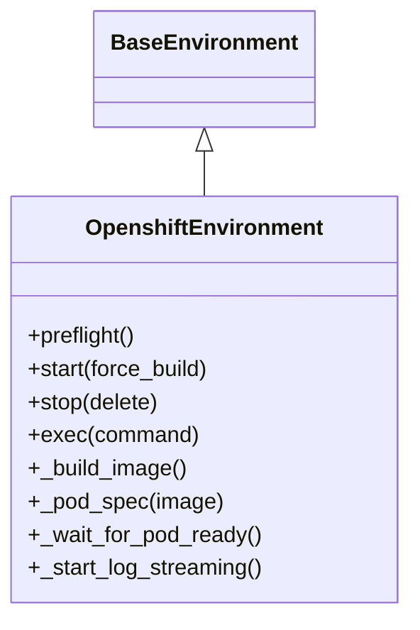
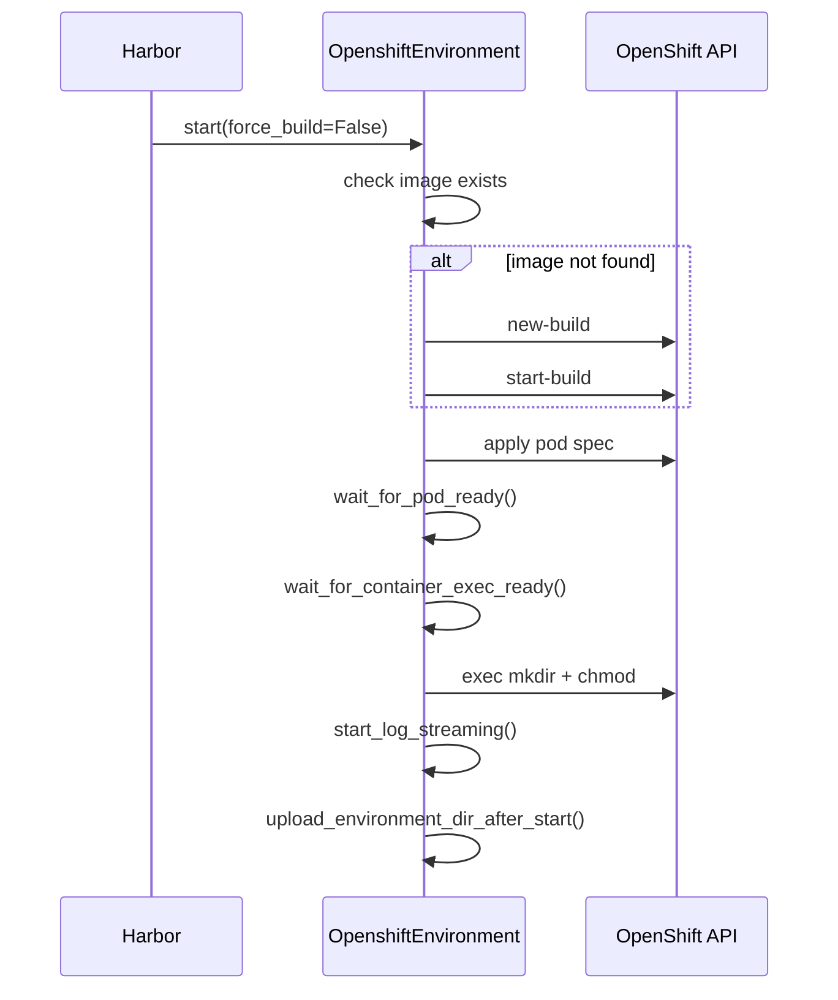

# OpenShift Environment

The `OpenshiftEnvironment` class extends Harbor's `BaseEnvironment` to run benchmark tasks inside OpenShift pods. It is one of two environment adapters (alongside `PodmanEnvironment`) that allow Harbor to execute tasks in different runtime contexts.

## Architecture



## Key Responsibilities

### 1. Image Building

Uses OpenShift `oc new-build` / `oc start-build` to build container images from the Harbor environment directory (which contains a `Dockerfile`). Build images are cached using `asyncio.Lock` per environment name to avoid duplicate builds.

```python
# Build flow
oc new-build --binary --name=<build_name> --strategy=docker
oc start-build <build_name> --from-dir=<env_dir> --follow --wait
```

### 2. Pod Spec Generation

Each task runs in a dedicated pod with:

- **Service account**: `harbor-task` (anyuid SCC only, no API access)
- **User**: root (`runAsUser: 0`) for unrestricted task execution
- **Restart policy**: `Never` (one-shot execution)
- **Log streaming**: Continuously tails `.log` and `.txt` files in `/logs/` to container logs

### 3. Pod Lifecycle



### 4. Environment Validation

Requires at least one of:
- A `Dockerfile` in the environment directory
- A `docker_image` specified in `task_env_config`

### 5. Properties

| Property | Value |
|----------|-------|
| `type()` | `"openshift"` |
| `supports_gpus` | `False` |
| `can_disable_internet` | `False` |
| `is_mounted` | `False` |

## Name Sanitization

Pod and build names are sanitized to K8s-compatible identifiers:
- Lowercase, replace non-alphanumeric (except `-`) with `-`
- Strip leading dashes, prefix with `hb-` if needed
- Max 58 characters

## Evidence

- Source: `src/coding_agent_bench/harbor_envs/openshift.py`
- Used by: `HarborCommandBuilder._build_command()` when `environment == "openshift"`
- Import path: `coding_agent_bench.harbor_envs.openshift:OpenshiftEnvironment`
